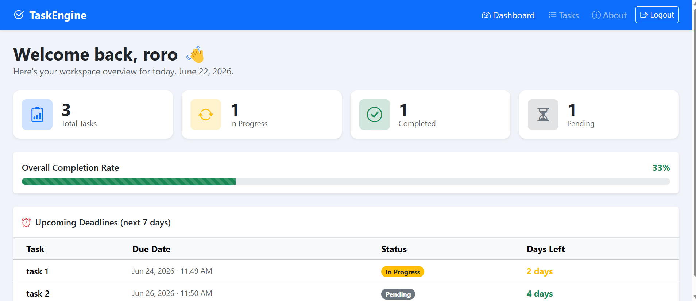

# TaskEngine – Smart Task Manager

TaskEngine is a modern, responsive, and robust task management workspace built with Django and vanilla JavaScript (AJAX). It allows users to seamlessly manage tasks, handle real-time status transitions, filter dynamically, and organize assignments with fluid, reload-free single-page capabilities.

## ✨ Features

- **Dynamic Task Creation & Deletion:** Add and remove tasks on the fly without refreshing the page.
- **In-Place Status Updates:** Swiftly modify task states (`Pending`, `In Progress`, `Completed`) via a streamlined dropdown interaction.
- **Advanced Categories Management:** Dynamically create, assign, and delete tags/categories utilizing custom AJAX controllers.
- **Client-Side Filtering & Live Search:** Filter items instantaneously based on completion status or specific text keywords.
- **Robust Security:** Full CSRF integration with asynchronous API calls.
- **Polished Responsive Design:** Styled completely using Bootstrap 5 and Bootstrap Icons for mobile-first compatibility.

## 🛠️ Tech Stack

- **Backend:** Django (Python)
- **Frontend:** Vanilla JavaScript (ES6+ AJAX Fetch API), HTML5, CSS3
- **UI Framework:** Bootstrap v5.3.3 & Bootstrap Icons

## 📂 Project Structure

```text
├── static/
│   └── tasks/
│       ├── js/
│       │   ├── task_actions.js       # Handles task operations, modal processing & filters
│       │   └── category_actions.js   # Logic for asynchronous category management
│       └── css/
│           └── style.css             # Main visual layout overrides
└── templates/
    └── tasks.html                    # The core workspace view engine

    
    